<!-- Cover is generated — see tools/cover (`npm run build`), rebuilt on push & weekly
     by .github/workflows/cover.yml. The card's content also lives in the image `alt`
     for accessibility (an -embedded SVG exposes only its alt to assistive tech).
     The name is intentionally omitted — it's on the profile. -->

  <picture>
    <source media="(prefers-color-scheme: dark)" srcset="assets/cover-dark.svg" />
    <source media="(prefers-color-scheme: light)" srcset="assets/cover-light.svg" />
    
  </picture>

  <a href="https://github.com/andrejusk?tab=repositories&sort=stargazers">projects</a> &nbsp;·&nbsp;
  <a href="https://github.com/andrejusk?tab=stars">stars ⭐</a> &nbsp;·&nbsp;
  <a href="https://github.com/andrejusk/dotfiles">dotfiles</a>
  <!-- invisible visit tracker — feeds the visits sparkline -->
  

